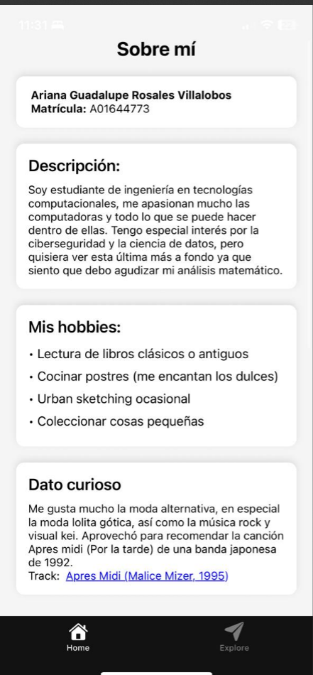
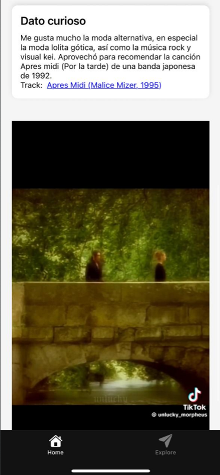
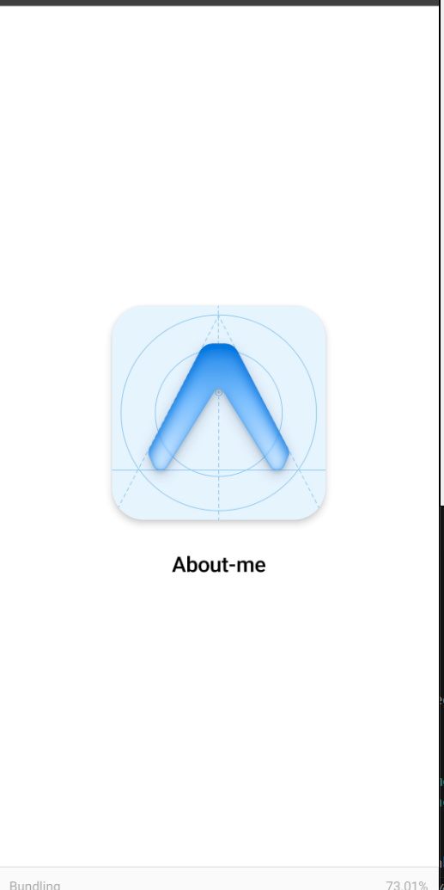
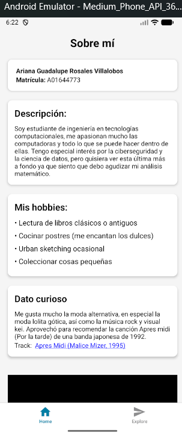

# 📱 Mi App "About ME" Expo

Aplicación desarrollada con [Expo](https://expo.dev/) y React Native.  
Esta app es un ejemplo simple del uso de componentes básicos.  

---

## 🚀 Requisitos

- [Node.js](https://nodejs.org/) (v17 o superior recomendado)  
- Tener instalada la app **Expo Go** en tu celular (Android/iOS) o usar un emulador.  

---

## ▶️ Cómo correr la app

1. **Clona este repositorio**
   ```bash
   git clone https://github.com/Peripera/Aboutme.git
   cd mi-app-expo
   ```

2. **Instala dependencias**
   ```bash
   npm install
   ```
   o
   ```bash
   yarn install
   ```

3. **Inicia el servidor de desarrollo**
   ```bash
   npx expo start
   ```

4. **Abre la app**
   - En tu celular: escanea el código QR con la app **Expo Go**.  
   - En Android Emulator: presiona `a`.  
   - En iOS Simulator (solo Mac): presiona `i`.  

---

## Demostración de la ejecución

### Pantalla en la aplicación Expo
<p align="center">
  
  
</p>

### Pantalla del emulador Android
<p align="center">
  
  
  
</p>


## 🛠 Scripts útiles

- `npm start` — Inicia el proyecto con Expo.  
- `npm run android` — Ejecuta en emulador Android.  
- `npm run ios` — Ejecuta en simulador iOS (solo Mac).  
- `npm run web` — Ejecuta la app en navegador.  